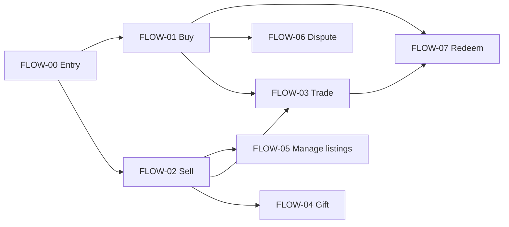

# ExtraCare Marketplace — flow documentation

Living source for **user paths** before screens. Each path has its own file under [`flows/`](./flows/). Update flows first; **build packages** live in [FEATURES.md](./FEATURES.md) / [features/](./features/); derive IA and screens in [APP.md](./APP.md) per feature.

**Product context:** [Wiki](docs/WIKI.md) · [CONCEPT.md](./CONCEPT.md) · **Product:** [PRD-cvs-coupon-marketplace.md](./PRD-cvs-coupon-marketplace.md) · **Build:** [FEATURES.md](./FEATURES.md)

---

## Flow catalog

| ID | Flow | File | Priority | Portfolio demo |
|----|------|------|----------|----------------|
| FLOW-00 | Marketplace entry & rules | [FLOW-00-marketplace-entry.md](./flows/FLOW-00-marketplace-entry.md) | P1 | Optional opener |
| FLOW-01 | Buy a listing | [FLOW-01-buy.md](./flows/FLOW-01-buy.md) | **P0** | Yes |
| FLOW-02 | Sell from wallet | [FLOW-02-sell.md](./flows/FLOW-02-sell.md) | **P0** | Yes |
| FLOW-03 | Trade offers | [FLOW-03-trade.md](./flows/FLOW-03-trade.md) | **P0** | Yes |
| FLOW-04 | Gift to member | [FLOW-04-gift.md](./flows/FLOW-04-gift.md) | P2 | Optional |
| FLOW-05 | Manage my listings | [FLOW-05-manage-listings.md](./flows/FLOW-05-manage-listings.md) | P1 | Seller side |
| FLOW-06 | Dispute & refund | [FLOW-06-dispute-refund.md](./flows/FLOW-06-dispute-refund.md) | **P0** | Trust story |
| FLOW-07 | Redeem purchased offer | [FLOW-07-redeem.md](./flows/FLOW-07-redeem.md) | P1 | Closes loop |

**Suggested case study paths:** FLOW-02 → FLOW-01 (supply then demand), or FLOW-01 alone + FLOW-06 snippet; add FLOW-03 for differentiation.

---

## Entry points (where flows start)

| Entry | Typical next flow |
|-------|-------------------|
| Deals & Rewards → Marketplace tab | FLOW-01 (browse) |
| Wallet coupon → “Not for me” / “Sell or trade” | FLOW-02 or FLOW-03 |
| Marketplace listing detail | FLOW-01 or FLOW-03 |
| Push: “Your listing expires soon” | FLOW-05 |
| Push: “Purchase complete” / “Offer in your wallet” | FLOW-07 |
| Push: “Rate your seller” | After FLOW-01 / FLOW-07 |
| Settings → Marketplace history | FLOW-05, FLOW-06 |
| First visit to Marketplace | FLOW-00 |

---

## Shared system rules (all flows)

Do not duplicate these in every file—link back here.

1. **Transfer:** On successful buy, trade, or gift, the offer is **voided on the seller** and **re-issued on the buyer** (same terms, new transfer ID). No sharing phone numbers at checkout as the product mechanic.
2. **Listing:** One **active listing** per offer entitlement ID. Listing reserves/voids seller copy per FLOW-02.
3. **Escrow (paid buy):** Buyer funds held until **wallet verification** on buyer account (target &lt; 15 min). Then seller payout minus platform fee.
4. **Preview:** Listings show terms and category art—not scannable barcodes. Full offer only in buyer wallet post-transfer.
5. **Sell eligibility:** ExtraCare linked, verified phone, account **≥ 7 days** for paid sell (case study rule). New sellers: **listing cap** until first successful sale.
6. **Pricing:** Platform suggests range; **floor/ceiling** vs estimated savings (e.g. 20–80%). Out-of-range requires edit or blocks publish.
7. **Disputes:** Buyer may open within **24h** of transfer for “not in wallet” / “terms mismatch.” See FLOW-06.
8. **Redemption:** POS redemption delists any stale reference and ties to transfer ID for abuse detection.

---

## Flow relationship map

---

## Conventions for editing flows

- Write **user actions** and **system responses**—avoid screen names.
- Use **Decision points** for branches; link other flows by ID.
- Mark **Open questions** per flow; resolve into PRD or here when decided.
- When a flow changes, update this catalog row only if priority/demo status changes.
- **Decisions** (payment, UX toggles): record in linked **FEAT-XX** file, not only in flow open questions.
- **Visual paths:** step-by-step behavior here; **journey diagrams** live in [features/maps/](features/maps/) per FEAT.

### Flow → feature map

| Flow | Primary feature |
|------|-----------------|
| FLOW-00 | FEAT-00 |
| FLOW-01 | FEAT-01 (+ escrow detail in FEAT-05) |
| FLOW-02 | FEAT-02 |
| FLOW-03 | FEAT-03 |
| FLOW-04 | FEAT-07 |
| FLOW-05 | FEAT-04 |
| FLOW-06 | FEAT-05 |
| FLOW-07 | FEAT-06 |

---

## Glossary

| Term | Meaning |
|------|---------|
| **Offer** | ExtraCare coupon/deal in wallet (transferable type) |
| **Listing** | Public marketplace view of an offer for sale or trade |
| **Transfer ID** | Support/audit reference for one void + re-issue |
| **Escrow** | Held payment until wallet sync confirms |
| **CRT-style** | Personalized receipt/app offer with thresholds |

---

## Changelog

| Date | Change |
|------|--------|
| 2026-03-24 | Initial flow set scaffolded from PRD |
| 2026-03-24 | Feature flow maps added under features/maps/ |
