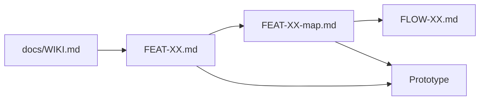

# ExtraCare Marketplace — project wiki

**Start here** for product overview, goals, research, how we document and build, and links to every project file. This repo is the single source of truth (version in **git**; share on **GitHub** for portfolio reviewers).

| Quick links | |
|-------------|--|
| Pitch | [CONCEPT.md](../CONCEPT.md) |
| People | [PERSONAS.md](../PERSONAS.md) |
| Requirements | [PRD-cvs-coupon-marketplace.md](../PRD-cvs-coupon-marketplace.md) |
| Build index | [FEATURES.md](../FEATURES.md) |
| Design paths | [features/maps/](../features/maps/) |

---

## 1. Product at a glance

**ExtraCare Marketplace** is a case-study feature inside the existing **CVS Health** app: an in-app venue where ExtraCare members **buy, sell, and trade** personalized coupons so offers reach shoppers who will actually use them.

Members today get many deals per trip; many expire unused or do not match need. Price-sensitive shoppers also compare personal care to **Amazon** and **Walmart**. The marketplace **productizes** offer flow with **official transfer** (void on seller, re-issue on buyer), **escrow** on paid buys, and **trust controls**—not informal “use someone else’s phone number at checkout.”

**Framing:** Portfolio product design—credible and real-world, not a CVS legal or CPG compliance submission. See [CONCEPT.md](../CONCEPT.md).

---

## 2. Goals

### User goals

| Persona | Goals |
|---------|--------|
| **P1 Jordan** — overwhelmed regular | Offload irrelevant coupons easily; suggested pricing; trust that listing is safe |
| **P2 Sam** — category hunter | Find the right deals before expiry; buy with escrow; wallet proof before shopping |

Detail: [PERSONAS.md](../PERSONAS.md)

### Business goals (case study)

- Increase coupon **redemption** and relevant **category** purchases  
- Grow **basket size** (threshold deals land with matched buyers)  
- Improve **loyalty** and **app engagement** (Savings / Marketplace)

### Portfolio goals

- Clear story: **Jordan lists → Sam buys → wallet + transfer ID** (optional redeem)  
- Show **flows**, **persona-driven features**, **CVS UI continuity**, and **trust/fraud** thinking  

### Success metrics (target)

| Metric | Why |
|--------|-----|
| Redemption rate (issued → redeemed) | Primary value |
| Time-to-redemption | Faster match via marketplace |
| App sessions (Savings / Marketplace) | Engagement |
| Dispute / fraud rate | Guardrail |

---

## 3. Why we’re building it

- **Overload:** 1–20+ personalized coupons; many poor fits (demographics, stock, category).  
- **Waste:** Expiration and confusing rules ($ off thresholds, multi-buy).  
- **Competition:** Effective price vs Amazon/Walmart on personal care.  
- **Gray market today:** Family shares ExtraCare at register—awkward and not scalable.  
- **Solution:** CVS-mediated **marketplace** with atomic transfer and escrow.

Shared product rules: [FLOWS.md](../FLOWS.md) (transfer, escrow, one listing per offer, disputes).

---

## 4. Research and references

### CVS app (primary UI research)

Screenshots and patterns: bottom **sheets**, Savings **coupon cards**, **segmented tabs** (All / On card / For you), Sort & refine, Scan in store FAB.

- [UI-PATTERNS-AND-IA.md](./cvs-app-reference/UI-PATTERNS-AND-IA.md)  
- [SCREEN-INVENTORY.md](./cvs-app-reference/SCREEN-INVENTORY.md)  
- [cvs-app-reference/README.md](./cvs-app-reference/README.md)

### Product and industry context

- ExtraCare offers are **account-bound**; marketplace assumes **authorized re-issue** on transfer (case study).  
- Fraud and abuse: escrow, limits, disputes—[PRD §7.3](../PRD-cvs-coupon-marketplace.md).  
- P2P coupon marketplaces exist globally; US drug-retail transfer is different—see PRD research summary.

### Process (work-style)

- Feature shape: [work-item-template.md](./work-item-template.md)  
- Optional AzDO screenshots: [azdo-reference/README.md](./azdo-reference/README.md)

### Open decisions

- [FEATURES.md § Wave A](../FEATURES.md#wave-a-decisions-blocking-ready) and each FEAT **Decisions** table  
- [NOTES.md](../NOTES.md) decisions log  

---

## 5. Who it’s for

| ID | Name | Marketplace role |
|----|------|------------------|
| **P1** | Jordan Reyes | Primarily **sell** / “not for me” |
| **P2** | Sam Okonkwo | Primarily **browse & buy** |

Persona ↔ feature map: [PERSONAS.md § map](../PERSONAS.md#persona--feature-map)

**Core loop:** [APP.md](../APP.md#core-loop)

---

## 6. How we’re building it

### Documentation layers

| Layer | Location | Use when |
|-------|----------|----------|
| Wiki (you are here) | `docs/WIKI.md` | Onboarding, portfolio overview |
| Why | [CONCEPT.md](../CONCEPT.md) | Problem / idea |
| Who | [PERSONAS.md](../PERSONAS.md) | Design and AC alignment |
| Product | [PRD](../PRD-cvs-coupon-marketplace.md) | Requirements, fraud, metrics |
| Behavior | [FLOWS.md](../FLOWS.md) + [flows/](../flows/) | Steps, branches, system truths |
| Delivery | [FEATURES.md](../FEATURES.md) + [features/](../features/) | Req, stories, AC, decisions |
| Visual journeys | [features/maps/](../features/maps/) | Design and **build** paths (Mermaid) |
| IA / shell | [APP.md](../APP.md) + CVS UI ref | Where it lives in CVS app |
| UI/UX guardrails | [DESIGN-GUARDRAILS.md](./DESIGN-GUARDRAILS.md) | Prototype MUST/MUST NOT + defaults |
| Build prompts | [BUILD-PROMPTS.md](./BUILD-PROMPTS.md) | Short Agent copy/paste per FEAT |
| Demo resets | [DEMO-CONTROLS.md](./DEMO-CONTROLS.md) | Prototype panel — no persona toggle |
| Scratch | [NOTES.md](../NOTES.md) | Informal notes |

### Build contract

Say **“build FEAT-XX”** (e.g. FEAT-00 + FEAT-01 + FEAT-02 for Wave A):

1. Read `features/FEAT-XX.md` + `features/maps/FEAT-XX-map.md`  
2. Persona lens + AC; linked `flows/FLOW-XX.md` + [FLOWS.md](../FLOWS.md)  
3. UI from [CVS UI patterns](./cvs-app-reference/UI-PATTERNS-AND-IA.md) + [DESIGN-GUARDRAILS.md](./DESIGN-GUARDRAILS.md)  
4. No screen inventory—follow **map nodes**  

Full contract: [FEATURES.md § Build handoff](../FEATURES.md#build-handoff-contract)

### Waves

| Wave | Features | Outcome |
|------|----------|---------|
| A | FEAT-00, 01, 02 | List → buy → wallet |
| B | FEAT-03 | Trade |
| C | FEAT-04, 05 | Listings mgmt + trust |
| D | FEAT-06, 07 | Redeem, gift |

### Tech (when we code)

- React + Tailwind; mobile-first web prototype  
- [README.md](../README.md) stack notes  

---

## 7. Documentation map

### Root

| File | Purpose |
|------|---------|
| [README.md](../README.md) | Project card, doc table |
| [CONCEPT.md](../CONCEPT.md) | Problem, idea, non-goals |
| [PERSONAS.md](../PERSONAS.md) | P1 / P2 |
| [PRD-cvs-coupon-marketplace.md](../PRD-cvs-coupon-marketplace.md) | PRD |
| [FLOWS.md](../FLOWS.md) | Flow catalog, shared rules |
| [FEATURES.md](../FEATURES.md) | Features index, waves, handoff |
| [APP.md](../APP.md) | IA, core loop, flow maps pointer |
| [NOTES.md](../NOTES.md) | Scratch + decisions log |

### flows/

| File |
|------|
| [FLOW-00-marketplace-entry.md](../flows/FLOW-00-marketplace-entry.md) |
| [FLOW-01-buy.md](../flows/FLOW-01-buy.md) |
| [FLOW-02-sell.md](../flows/FLOW-02-sell.md) |
| [FLOW-03-trade.md](../flows/FLOW-03-trade.md) |
| [FLOW-04-gift.md](../flows/FLOW-04-gift.md) |
| [FLOW-05-manage-listings.md](../flows/FLOW-05-manage-listings.md) |
| [FLOW-06-dispute-refund.md](../flows/FLOW-06-dispute-refund.md) |
| [FLOW-07-redeem.md](../flows/FLOW-07-redeem.md) |

### features/

| File |
|------|
| [FEAT-00-marketplace-foundation.md](../features/FEAT-00-marketplace-foundation.md) |
| [FEAT-01-buy-browse.md](../features/FEAT-01-buy-browse.md) |
| [FEAT-02-sell-list.md](../features/FEAT-02-sell-list.md) |
| [FEAT-03-trade.md](../features/FEAT-03-trade.md) |
| [FEAT-04-my-listings.md](../features/FEAT-04-my-listings.md) |
| [FEAT-05-trust-escrow-dispute.md](../features/FEAT-05-trust-escrow-dispute.md) |
| [FEAT-06-redeem.md](../features/FEAT-06-redeem.md) |
| [FEAT-07-gift.md](../features/FEAT-07-gift.md) |

### features/maps/

| File |
|------|
| [README.md](../features/maps/README.md) |
| [FEAT-00-map.md](../features/maps/FEAT-00-map.md) … [FEAT-07-map.md](../features/maps/FEAT-07-map.md) |

### docs/

| File |
|------|
| **WIKI.md** (this page) |
| [work-item-template.md](./work-item-template.md) |
| [cvs-app-reference/](./cvs-app-reference/) (UI-PATTERNS, SCREEN-INVENTORY, README) |
| [azdo-reference/README.md](./azdo-reference/README.md) |

---

## 8. Current status and next steps

| Item | Status |
|------|--------|
| Product docs | In place (CONCEPT → maps) |
| CVS UI reference | From app screenshots |
| Prototype code | Not started |
| Wave A FEATs | `draft` — decisions TBD |

**Suggested next steps**

1. Resolve [Wave A decisions](../FEATURES.md#wave-a-decisions-blocking-ready) → mark FEAT-00/01/02 `ready`  
2. **Build FEAT-00 + FEAT-01 + FEAT-02** using flow maps  
3. Push repo to **GitHub** for portfolio; add repo URL and live prototype link below  

### Portfolio links (fill in when ready)

| Resource | URL |
|----------|-----|
| GitHub repository | _TBD_ |
| Live prototype | _TBD_ |

---

## 9. Wiki changelog

| Date | Change |
|------|--------|
| 2026-03-24 | Initial project wiki hub |
