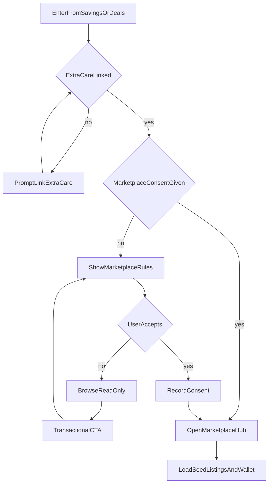

# FEAT-00 flow map — Marketplace foundation

| | |
|--|--|
| **Feature** | [FEAT-00](../FEAT-00-marketplace-foundation.md) |
| **Wave** | A |
| **Personas** | P1 Jordan, P2 Sam |
| **Flow** | [FLOW-00](../../flows/FLOW-00-marketplace-entry.md) |
| **Depends** | — |

## Scope

Reach Marketplace from the app shell, accept rules once, and use shared offer/listing/transfer data for later features.

## Entry points

- Savings tab → Marketplace (new segment or link)
- First transactional action without consent
- Deep link to Marketplace (case study)

## Journey map

## Key error branches

| Branch | Outcome |
|--------|---------|
| Consent declined | Browse only; buy/sell/trade blocked until accept |
| ExtraCare not linked | Block transactional paths until linked |

## Cross-feature exits

- `marketplaceHub` → [FEAT-01-map](./FEAT-01-map.md) browse
- `marketplaceHub` → [FEAT-02-map](./FEAT-02-map.md) via wallet (On card)
- Wallet / Savings patterns → [UI-PATTERNS §5](../../docs/cvs-app-reference/UI-PATTERNS-AND-IA.md)

## Persona paths

- **P1 Jordan:** Needs `showRules` in plain language; rarely explores hub without sell intent from wallet.
- **P2 Sam:** Needs trust copy in `showRules` (escrow, official transfer); enters hub to browse.

## Traceability

| Node | FLOW | REQ |
|------|------|-----|
| showRules / acceptRules | FLOW-00 steps 2–4 | REQ-00-02, REQ-00-03 |
| linkEC | FLOW-00 step 2 | REQ-00-04 |
| marketplaceHub | FLOW-00 step 5 | REQ-00-01 |
| seedData | — | REQ-00-05–07 |
