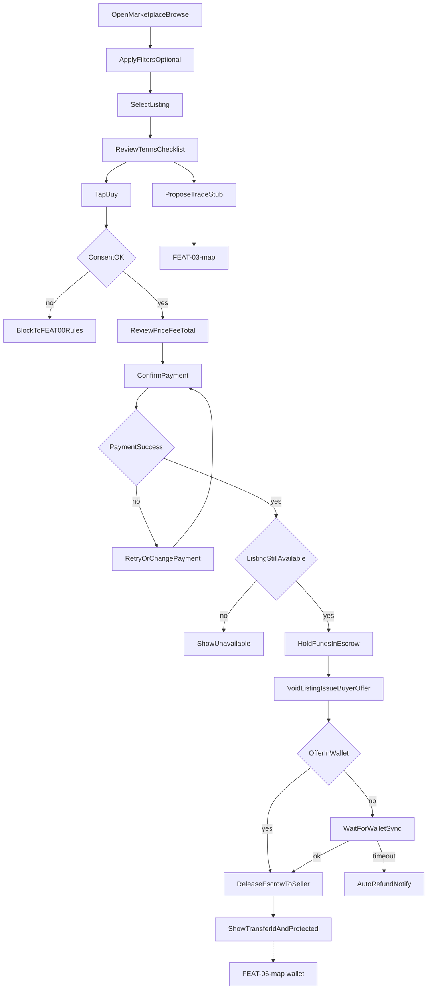

# FEAT-01 flow map — Buy & browse

| | |
|--|--|
| **Feature** | [FEAT-01](../FEAT-01-buy-browse.md) |
| **Wave** | A |
| **Personas** | P2 Sam (primary) |
| **Flow** | [FLOW-01](../../flows/FLOW-01-buy.md) |
| **Depends** | FEAT-00 |

## Scope

Sam finds a listing, reviews terms, pays with escrow, receives offer in wallet with transfer ID.

## Entry points

- Marketplace hub (FEAT-00)
- Savings → Marketplace segment
- Listing detail from push (future)

## Journey map

## Key error branches

| ID | Trigger | Outcome |
|----|---------|---------|
| err_consent | No marketplace consent | Redirect to FEAT-00 rules |
| err_pay | Payment failed | No transfer; retry |
| err_sold | Concurrent purchase | Unavailable message |
| err_refund | Wallet sync &gt; 15 min | Refund; notify parties |

## Cross-feature exits

- `stubTrade` → [FEAT-03-map](./FEAT-03-map.md)
- `success` → [FEAT-06-map](./FEAT-06-map.md) (redeem)
- Dispute path → [FEAT-05-map](./FEAT-05-map.md) from purchase history

## Persona paths

- **P2 Sam:** Full happy path; uses `filter`, `reviewTerms`, escrow messaging.
- **P1 Jordan:** Rare entry; same path if buying from push.

## Traceability

| Node | FLOW step | REQ |
|------|-----------|-----|
| filter | 1 | REQ-01-01 |
| reviewTerms | 2 | REQ-01-02 |
| reviewTotal / confirmPay | 3–4 | REQ-01-03–04 |
| escrow / transfer / success | 5–6 | REQ-01-04–05 |
| releaseEscrow | 7 | REQ-01-06 |
| err_pay | failure | REQ-01-07 |
| err_sold | failure | REQ-01-08 |
| err_refund | failure | REQ-01-09 |
| err_consent | failure | REQ-01-10 |
