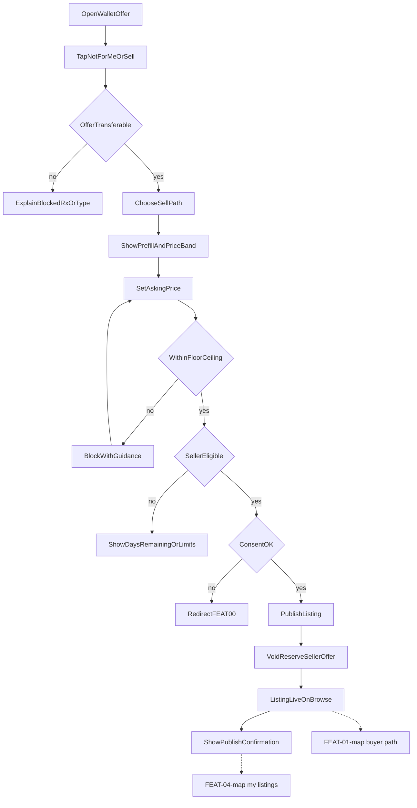

# FEAT-02 flow map — Sell & list

| | |
|--|--|
| **Feature** | [FEAT-02](../FEAT-02-sell-list.md) |
| **Wave** | A |
| **Personas** | P1 Jordan (primary) |
| **Flow** | [FLOW-02](../../flows/FLOW-02-sell.md) |
| **Depends** | FEAT-00 |

## Scope

Jordan lists a transferable wallet offer at a valid price; offer reserved on card; listing live for buyers.

## Entry points

- Savings → On card → offer → Not for me / Sell
- Marketplace sell CTA (optional)

## Journey map

## Key error branches

| ID | Trigger | Outcome |
|----|---------|---------|
| err_block | Non-transferable offer | Explain; no publish |
| err_price | Outside band | Adjust price |
| err_elig | New account / cap | Eligibility copy |
| err_consent | No consent | FEAT-00 |

## Cross-feature exits

- `live` → visible in [FEAT-01-map](./FEAT-01-map.md) `pickListing`
- `confirm` → [FEAT-04-map](./FEAT-04-map.md)
- Trade/gift stubs → FEAT-03 / FEAT-07 (out of scope v1 sell path)

## Persona paths

- **P1 Jordan:** Primary `notForMe` → `prefill` → suggested price → `publish`; needs void-on-list clarity.
- **P2 Sam:** Does not use this map in Wave A demo.

## Traceability

| Node | FLOW step | REQ |
|------|-----------|-----|
| notForMe | 1–2 | REQ-02-01 |
| err_block | 3 | REQ-02-02 |
| chooseSell | 4 | REQ-02-03 |
| prefill / setPrice | 5–6 | REQ-02-04–05 |
| publish / reserve / live | 7–8 | REQ-02-06 |
| confirm | 9 | REQ-02-07 |
| err_elig | failure | REQ-02-08–09 |
| err_consent | failure | REQ-02-10 |
