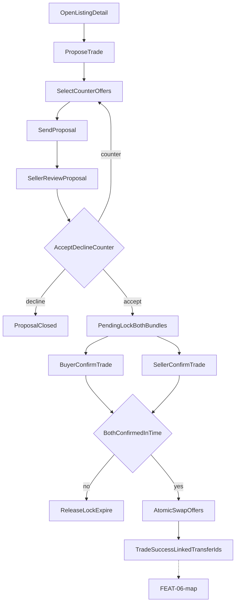

# FEAT-03 flow map — Trade

| | |
|--|--|
| **Feature** | [FEAT-03](../FEAT-03-trade.md) |
| **Wave** | B |
| **Personas** | P2 Sam (primary), P1 Jordan (seller) |
| **Flow** | [FLOW-03](../../flows/FLOW-03-trade.md) |
| **Depends** | FEAT-01, FEAT-02 |

## Scope

Propose trade on a listing, negotiate, dual confirm, atomic swap of offers.

## Entry points

- Listing detail → Propose trade (from FEAT-01)
- Trade-preferred listing (seller)

## Journey map

## Key error branches

| ID | Trigger | Outcome |
|----|---------|---------|
| err_timeout | One party never confirms | Offers released |
| Invalid bundle | Offer listed elsewhere | Block bundle selection |

## Cross-feature exits

- Entry from [FEAT-01-map](./FEAT-01-map.md) `stubTrade` / `propose`
- `done` → wallet → [FEAT-06-map](./FEAT-06-map.md)

## Persona paths

- **P2 Sam:** Initiates `propose` → `pickBundle` → `buyerConfirm`.
- **P1 Jordan:** `sellerReview` → `sellerConfirm` when receiving proposals on their listing.

## Traceability

| Node | FLOW step | REQ |
|------|-----------|-----|
| propose–send | 1–4 | REQ-03-01–02 |
| sellerReview | 5–6 | REQ-03-03 |
| lock / confirm | 7–8 | REQ-03-04 |
| swap / done | 9 | REQ-03-05 |
| err_timeout | decision | REQ-03-06 |
