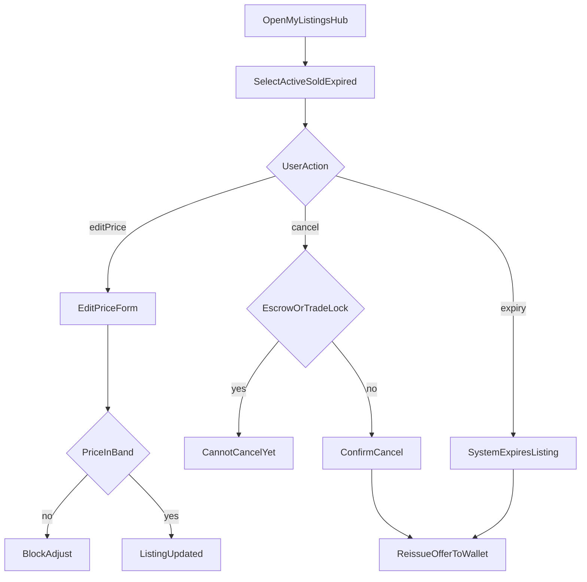

# FEAT-04 flow map — My listings

| | |
|--|--|
| **Feature** | [FEAT-04](../FEAT-04-my-listings.md) |
| **Wave** | C |
| **Personas** | P1 Jordan (primary) |
| **Flow** | [FLOW-05](../../flows/FLOW-05-manage-listings.md) |
| **Depends** | FEAT-02 |

## Scope

Jordan monitors, edits price, cancels, and handles expiry on active listings.

## Entry points

- Publish confirmation (FEAT-02)
- Marketplace → My listings
- Push: listing expiring

## Journey map

## Key error branches

| ID | Trigger | Outcome |
|----|---------|---------|
| err_block | Purchase in flight / trade lock | Message; retry later |
| err_price | Outside band on edit | Same as FEAT-02 |

## Cross-feature exits

- Entry from [FEAT-02-map](./FEAT-02-map.md) `confirm`
- Active listings feed [FEAT-01-map](./FEAT-01-map.md)

## Persona paths

- **P1 Jordan:** Primary user of `OpenMyListingsHub` and `cancel` / `edit`.

## Traceability

| Node | FLOW | REQ |
|------|------|-----|
| tab | monitor | REQ-04-01 |
| edit | edit | REQ-04-02 |
| cancel / restore | cancel | REQ-04-03 |
| err_block | decision | REQ-04-04 |
| autoExpire | expiry | REQ-04-05 |
