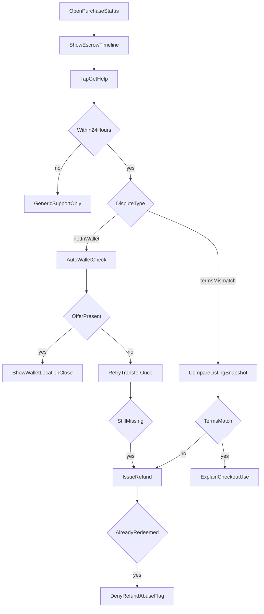

# FEAT-05 flow map — Trust, escrow & dispute

| | |
|--|--|
| **Feature** | [FEAT-05](../FEAT-05-trust-escrow-dispute.md) |
| **Wave** | C |
| **Personas** | P2 Sam (primary), P1 Jordan (seller payout) |
| **Flow** | [FLOW-06](../../flows/FLOW-06-dispute-refund.md) |
| **Depends** | FEAT-01 |

## Scope

Show escrow timeline; file dispute within 24h; auto wallet check and refund path.

## Entry points

- Post-purchase status (FEAT-01 success)
- Purchase history → Get help
- Account → Purchases & Savings

## Journey map

## Key error branches

| ID | Trigger | Outcome |
|----|---------|---------|
| err_late | Outside 24h | No auto refund in app |
| err_deny | Redeem then dispute | Deny; pattern flag |

## Cross-feature exits

- Entry from [FEAT-01-map](./FEAT-01-map.md) `success` / `err_refund`
- Education links → [FEAT-06-map](./FEAT-06-map.md)

## Persona paths

- **P2 Sam:** `help`, `notInWallet`, expects `refund` if broken.
- **P1 Jordan:** Sees payout side of `timeline`; may receive seller notification on dispute.

## Traceability

| Node | FLOW | REQ |
|------|------|-----|
| timeline | escrow | REQ-05-01 |
| help | step 1 | REQ-05-02 |
| autoCheck / refund | path 1 | REQ-05-03 |
| compare | path 2 | REQ-05-04 |
| window | decision | REQ-05-05 |
| err_deny | failure | REQ-05-06 |
