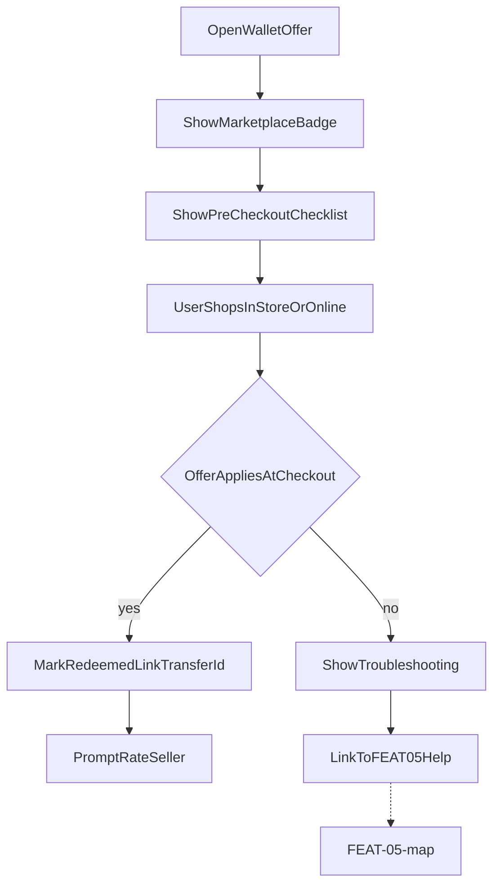

# FEAT-06 flow map — Redeem & close loop

| | |
|--|--|
| **Feature** | [FEAT-06](../FEAT-06-redeem.md) |
| **Wave** | D |
| **Personas** | P2 Sam (primary) |
| **Flow** | [FLOW-07](../../flows/FLOW-07-redeem.md) |
| **Depends** | FEAT-01 or FEAT-03 |

## Scope

Pre-checkout checklist, marketplace badge on wallet offer, simulate redeem, rate seller.

## Entry points

- Wallet → marketplace-acquired offer (FEAT-01/03)
- Savings → On card

## Journey map

## Key error branches

| ID | Trigger | Outcome |
|----|---------|---------|
| troubleshoot | Wrong SKU / threshold | Help content; optional dispute |

## Cross-feature exits

- Entry from [FEAT-01-map](./FEAT-01-map.md) `success`
- `disputeLink` → [FEAT-05-map](./FEAT-05-map.md)

## Persona paths

- **P2 Sam:** Full path before stock-up trip; relies on `checklist` and `badge`.

## Traceability

| Node | FLOW | REQ |
|------|------|-----|
| badge / checklist | 1 | REQ-06-01–02 |
| redeem | 3–4 | REQ-06-03 |
| rate | 6 | REQ-06-04 |
| troubleshoot | decision | REQ-06-05 |
