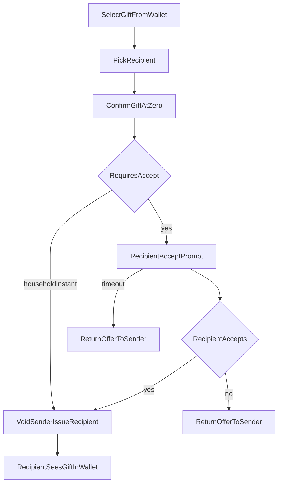

# FEAT-07 flow map — Gift

| | |
|--|--|
| **Feature** | [FEAT-07](../FEAT-07-gift.md) |
| **Wave** | D |
| **Personas** | P1 Jordan (sender), P2 Sam (recipient) |
| **Flow** | [FLOW-04](../../flows/FLOW-04-gift.md) |
| **Depends** | FEAT-00 |

## Scope

Gift transferable offer to another member; transfer or accept flow; return on decline.

## Entry points

- Wallet offer → Gift
- FEAT-02 path alternative (not sell)

## Journey map

## Key error branches

| ID | Trigger | Outcome |
|----|---------|---------|
| err_decline / err_timeout | Recipient rejects or 48h | Sender regains offer |

## Cross-feature exits

- Parallel to sell on wallet entry from [FEAT-02-map](./FEAT-02-map.md)

## Persona paths

- **P1 Jordan:** `start` → `recipient` → gift kids’ deals to partner.
- **P2 Sam:** `notify` → `accept` as recipient (optional demo).

## Traceability

| Node | FLOW | REQ |
|------|------|-----|
| recipient | 1–2 | REQ-07-01 |
| confirm / transfer | 3–5 | REQ-07-02 |
| done | 6 | REQ-07-03 |
| err_decline / timeout | decision | REQ-07-04 |
